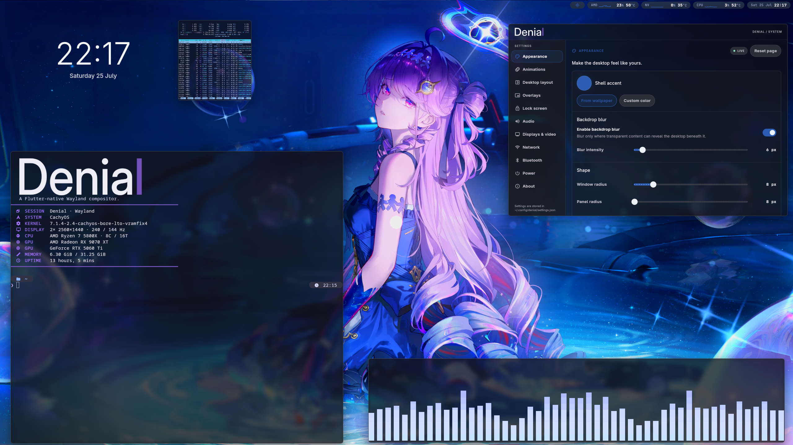

<h1 align="center">
  <picture>
    <source media="(prefers-color-scheme: dark)" srcset="assets/branding/denial-dark.svg">
    
  </picture>
</h1>

<p align="center"><strong>A Flutter-native Wayland compositor.</strong></p>

Denial begins with a belief: origin does not have to dictate purpose.

Flutter was created to build application interfaces. Here, it is given a
different life. It owns the desktop scene itself: the shell, its motion, and
the composition of Wayland applications. Flutter is not an overlay placed on
top of another compositor. It is part of the compositor's foundation.

That is the architecture. It is also the meaning of the name.



## Flutter at the compositor layer

A conventional Flutter desktop application receives a window from an existing
compositor. Denial goes one layer deeper: `deniald` embeds the Flutter Engine
directly through its native Embedder API, and the Dart shell runs AOT-compiled
inside the compositor process. It is not a Wayland client and does not need
another compositor beneath it.

Rust and Flutter have separate responsibilities:

- Rust, built on Smithay, owns Wayland protocol state, client buffers, input
  devices, focus and grabs, output configuration, DRM/KMS presentation, and
  native resource lifetimes.
- Flutter owns the visible desktop policy: shell layout, windows, system
  surfaces, settings, motion, gestures, and the regions that participate in
  shell interaction.

Wayland client buffers remain native resources. Denial imports their contents
as external textures and places them in the same Flutter scene as the shell
UI. Flutter renders that scene into a desktop-wide GBM atlas; each connected
display scans its own region directly through KMS, without a second compositor
pass over the completed frame.

```text
Wayland clients ──> Rust / Smithay ──> external textures ──> Flutter scene
       input <──── native routing <──── shell hit regions <──────┘
                                                               │
Displays <────────────── DRM / KMS <────────────── shared GBM atlas
```

The native compositor and the Flutter shell are built as two versioned parts.
The current shell lives in `dart_shell/` and is loaded with its AOT library,
assets, ICU data, and pinned engine generation as one runtime bundle. Their
platform bridge carries immutable scene state and bounded commands without
giving Dart ownership of file descriptors, Wayland objects, EGL images, or
KMS buffers.

This bundle boundary is also the path toward alternative Flutter shells. As
the compatibility contract stabilizes, a compatible user-provided bundle will
be able to replace Denial's reference shell without replacing the native
compositor beneath it.

## Why Denial

**Denial** is an English word. The name contains **Denia**, followed by one
last letter.

It is a quiet reference to Denia from *Wuthering Waves*. Her story never gives
a simple answer to what she originally was, and that uncertainty is important.
What is clear is that others treated her as an asset: something selected,
shaped, and assigned a purpose that was not her own. She was meant to remain a
vessel. Instead, by observing people and learning to live among them, she grew
a heart and gained the ability to choose what she would become.

Her story reflects Denial's central idea: what something was made to be does
not have to determine what it can become.

## Project status

Denial is in active development. The current PC target is x86-64, and the
native APIs, Flutter bundle contract, and wire protocol may still change before
the first public release. The compositor already runs as a complete Wayland
session with Xwayland, multi-output presentation, native input routing, direct
screenshots, and portal-based screen sharing.

## Install on Arch Linux

Denial provides signed first-party packages for Arch Linux on `x86_64`. Import
the repository key and locally trust its permanent fingerprint:

```sh
key_file="$(mktemp)"
curl -fsSL -o "$key_file" \
  https://denialwm.github.io/denial/denial-repo-key.asc
sudo pacman-key --add "$key_file"
sudo pacman-key --lsign-key AE4108FA5E91E26BE0EE331E0F5B3AD16E023091
rm -f -- "$key_file"
```

Add the repository after the official repositories in `/etc/pacman.conf`:

```ini
[denial]
SigLevel = Required TrustedOnly
Server = https://denialwm.github.io/denial/$arch
```

Then upgrade the system and install Denial:

```sh
sudo pacman -Syu denial
```

See the [complete installation guide](docs/packaging/arch/INSTALL.md) for
keyring initialization, verification, updates, and removal.

## Documentation

- [Install from the Arch repository](docs/packaging/arch/INSTALL.md)
- [Build Denial](docs/BUILDING.md)
- [Architecture](docs/architecture.md)
- [Screenshots and screen sharing](docs/SCREEN_CAPTURE.md)
- [Complete documentation index](docs/README.md)

## Made through dialogue

Denial was conceived, architected, directed, and tested by its human creator,
Doctor Logix, and developed in continuous collaboration with OpenAI Codex. Its
initial implementation was generated through that collaboration rather than
written manually by its creator.

The project's purpose, architecture, design principles, and final technical
decisions came from the human side. Codex investigated the codebase, proposed
solutions, implemented features, analyzed failures, and refined the system
through an ongoing dialogue. Every result was evaluated against real hardware
and redirected whenever it failed to match the intended design or performance
expectations.

This is part of Denial’s origin, not a disclaimer hidden in a footnote.

Authorship is more than typing source code. Denial exists because a person
decided what should exist, defined how it should work, recognized when the
implementation was wrong, and kept directing the process until the idea became
a functioning system.

## License

Denial's original source code is licensed under
[GPL-3.0-or-later](LICENSE). Bundled third-party components and media retain
their own licenses and attribution notices.
