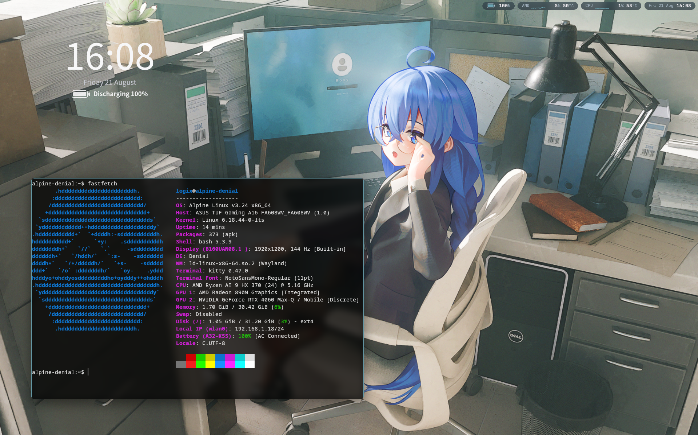

# Alpine Linux port and package feasibility report

Date: 2026-08-21
Validated target: Alpine Linux 3.24.1, x86-64, Linux LTS 6.18.44

## Executive conclusion

Denial runs as the primary Wayland compositor on Alpine Linux 3.24.  The
physical `.18` validation host reached a complete Flutter/Impeller desktop,
lock and unlock, native Wayland Kitty, Xwayland startup, PipeWire audio,
NetworkManager connectivity, polkit, and all three configured desktop-portal
backends.

The port required **no Alpine-specific changes to the Rust compositor, Dart
shell, wire protocol, or Flutter/Skia forks**.  The application remains
distribution-neutral.  All required runtime adaptation is isolated in the APK
adapter, two small compatibility libraries, and an OpenRC/elogind session
wrapper.

The result proves that an Alpine package is feasible. The trusted-branch and
signed-tag workflows now build, retain, promote, independently inspect, and
publish the two APKs. The current delivery lane is intentionally narrower than
Debian's: it publishes OpenPGP-signed direct downloads, not a native
RSA-signed APK repository, and it has not yet repeated the graphical test
matrix from a clean automated Alpine image.

The implementation is modest in line count but high in compatibility risk.
Creating the first working adapter was substantially more complicated than
adding Debian metadata around the shared glibc payload.  Once automated, the
expected recurring packaging work is moderate, with the main maintenance risk
concentrated at Flutter Engine upgrades and Alpine `gcompat` changes.

## Measured change surface

These counts include only the Alpine work described by this report.  Unrelated
compositor and shell work already present in the development worktree is
excluded.

| Scope | Files | Lines or change | Result |
| --- | ---: | ---: | --- |
| Rust compositor | 0 | 0 | No Alpine branch or runtime change |
| Dart shell and protocol | 0 | 0 | No Alpine branch or runtime change |
| Flutter and Skia forks | 0 | 0 | No source or lock change |
| New `packaging/alpine/` adapter | 10 | 537 lines | 288 implementation, 249 documentation/validation |
| New APK build/promotion/publication verifiers | 3 | 859 lines | Rootless build, no-compile promotion, native-client publication check |
| Branch and release workflows | 2 | +330 / -8 | Candidate handoff, hosted promotion, signing, and publication gates |
| Shared release tooling | 7 | +111 / -14 | Format inventory, signatures, source audit, and payload extraction |
| Binary validation evidence | 1 | 3,618,183 bytes | 1919×1199 Alpine desktop screenshot |

The 288 implementation lines in `packaging/alpine/` are:

| Component | Lines | Responsibility |
| --- | ---: | --- |
| `APKBUILD` | 154 | Dependencies, two packages, payload adaptation, prepared-payload promotion, ELF metadata, installation policy |
| Alpine session wrapper | 45 | User D-Bus, audio services, delayed polkit agent, persistent startup log |
| pthread stack bridge | 36 | Main-thread reserve and 8 MiB default pthread stacks before Dart starts |
| resolver bridge | 15 | Maps Flutter's glibc `__res_init` reference to musl `res_init` |
| OpenRC runtime-directory service | 15 | Creates the root-owned X11 socket directory before Xwayland |
| install/removal hooks | 17 | Enables and removes the OpenRC service without restarting the live session |
| Wayland session entry | 6 | Exposes Denial to a display manager |

The only shared packaging implementation change was one line in
`packaging/arch/denial-session`: the interpreter changed from the Arch-specific
`/usr/bin/bash` path to the portable `/usr/bin/env bash`.  The APK also
normalizes and verifies this shebang because a cached neutral payload may have
been staged by an older adapter.

## What was genuinely necessary for Alpine

### 1. A controlled glibc-to-musl boundary

Denial's version-neutral x86-64 payload is currently built on glibc 2.39.  The
Debian adapter can package those bytes unchanged because Debian is also a glibc
system.  Alpine uses musl, so the same binary first passes through Alpine's
official `gcompat` loader.

`gcompat` covered most of the ABI, but the Flutter/Dart runtime exposed two
remaining incompatibilities:

- Flutter references glibc's `__res_init`; musl provides the equivalent
  `res_init` entry point under a different symbol name.
- Dart assumes more stack headroom than musl's default main and worker thread
  stacks provide.

The adapter compiles 51 lines of C into two private shared objects.  `patchelf`
adds them and `libgcompat.so.0` to `deniald`'s `DT_NEEDED` list and gives the
binary a private `/usr/lib/denial/alpine` runtime search path.  This is scoped
to Denial: applications launched by the compositor do not inherit an
`LD_PRELOAD` compatibility environment.

This is the largest difference from Debian and the main long-term maintenance
risk.  Every Flutter Engine generation must re-run the symbol, stack, isolate,
and rendering checks against the supported Alpine release.

### 2. A non-systemd graphical session

Alpine uses OpenRC and elogind.  Denial's existing launcher already supports a
`launcher process` lifecycle when no systemd user manager exists, so the
compositor needed no distribution check.  The Alpine wrapper supplies the
surrounding desktop services:

- one `dbus-run-session` user bus;
- PipeWire, WirePlumber, and the PulseAudio compatibility server;
- the Alpine polkit-gnome agent, started only after Denial publishes a Wayland
  socket;
- a persistent log for failures that greetd otherwise leaves only on its VT.

An OpenRC one-shot service creates `/tmp/.X11-unix` as root with mode 1777.
Creating it in the unprivileged session is insufficient for rootless Xwayland.

### 3. Alpine-native dependency policy

APK has no weak `Recommends` tier.  Denial therefore declares the fonts needed
for a usable shell as hard dependencies:

- `font-noto` for Latin UI text;
- `font-noto-cjk` for Simplified Chinese;
- `font-noto-emoji` for emoji and status glyph fallback.

This fixed the empty Fontconfig catalog without manual downloads or copied
font files.  It is a package contract, so every user receives the fonts during
the Denial transaction.

Alpine also splits Kitty into a base package and separate `kitty-wayland` and
`kitty-x11` backends.  The base package alone installs a visible desktop entry
but cannot open a window.  Kitty is only a validation client, not a Denial
dependency, so the test host explicitly installed `kitty-wayland` rather than
making Denial choose a terminal emulator for every user.

### 4. Native account provisioning

Copying the CachyOS user's `$y$` yescrypt shadow hash into Alpine made every
correct password fail in musl's `pam_unix`.  Running Alpine's own `passwd`
generated the configured `$6$` SHA-512 hash and Denial unlock then succeeded.

This was a lab-provisioning error, not a Denial authentication defect and not
an APK dependency.  An installer must use Alpine's native account tools rather
than import password hashes from a glibc distribution.

## Work that belonged only to the validation lab

Several difficult failures were caused by the `.18` multi-boot test layout and
would not be part of a normal Alpine package installation:

- Alpine was installed into an isolated 32 GiB thin logical volume.
- The initramfs needed `dm-thin-pool` and `thin-provisioning-tools`, including
  `/usr/sbin/thin_check`, before it could activate that root volume.
- A transient `/dev/dm-9` root argument raced device-mapper enumeration; the
  persistent `/dev/mapper/denial_lab-alpine324` path fixed it.
- Limine URI fragments use BLAKE2b-512, not SHA-512.  Both produce 128 hex
  characters, but SHA-512 caused `hash for URI does not match!` before Linux
  started.
- Greetd's `/run/greetd.run` marker prevents `initial_session` from running a
  second time during the same boot.  Service restarts therefore reached
  agreety until the volatile marker was deliberately removed on the test host.

These issues are documented because they explain the validation history, but
they must not inflate estimates for installing a published APK on an ordinary
Alpine system.

## Comparison with the Debian package lane

| Area | Debian 13 / Ubuntu 24.04 | Alpine 3.24 |
| --- | --- | --- |
| C library | Native glibc 2.39-compatible payload | musl host with `gcompat` and two private bridges |
| Compiled payload | Preserved byte for byte | `deniald` ELF metadata is deliberately transformed |
| Package assembly | `dpkg-deb` adds control metadata on the normal builder | `abuild` needs an Alpine build root and compiles the bridges |
| Session manager | GDM, systemd user manager, packaged user target | greetd, OpenRC, elogind, standalone user bus |
| Desktop services | Activated through systemd and D-Bus | Explicitly owned by the Alpine session wrapper and D-Bus |
| Optional dependencies | `Recommends` and `Suggests` available | Essential user-visible fonts must be hard dependencies |
| Payload verification | Exact extraction comparison with shared staging | Must verify the shared payload plus an allowlisted ELF transformation and Alpine-owned files |
| Release delivery | Integrated signed APT packages/repository | OpenPGP-signed direct APK downloads; no native APKINDEX yet |

The existing Debian packager is a 153-line builder plus 26 lines of maintainer
hooks.  More importantly, it can run without compiling inside Debian or
inspecting the target distribution, and its strongest invariant is that every
payload byte matches shared staging.  Alpine's 288 implementation lines are
not dramatically larger, but they cross a libc boundary and therefore carry a
larger test matrix and a weaker default assumption about byte identity.

In practical terms:

- adding Debian was primarily **package metadata and target validation**;
- adding Alpine was **runtime ABI adaptation, session integration, package
  policy, and target validation**.

## Prototype iterations and what they found

Five local APK revisions were produced during validation:

| Revision | Purpose or finding |
| --- | --- |
| `r0` | Initial APK assembly and structural inspection |
| `r1` | First installed transaction; proved package ownership and automatic Noto dependencies |
| `r2` | Normalized the cached `/usr/bin/bash` shebang so greetd could execute the session |
| `r3` | Corrected Alpine's polkit-agent path and installed Kitty's separate Wayland backend on the host |
| `r4` | Deferred polkit until a Wayland socket exists and retained greetd startup output in a persistent log |

The final development artifacts were approximately 14.5 MB for `denial` and
7.8 MB for `denial-flutter-engine`.  Their installed dependency closure on the
validation image was about 818 MB, dominated by the complete graphical stack,
Mesa, portals, fonts, and the Flutter runtime rather than by the two bridges.

## Release automation and remaining work

The repository now implements the bounded first-party direct-download lane:

1. `tools/package-denial-apk` consumes locked native metadata on the CachyOS
   Actions runner, verifies the official Alpine 3.24.1 minirootfs SHA-256, and
   enters it through rootless Bubblewrap.
2. Network access is used to install declared Alpine build dependencies, then
   disabled while `abuild` compiles the bridges and assembles the candidate.
3. The branch artifact retains both unsigned APKs and a separately hashed
   Alpine-adapted payload. A hosted verifier independently extracts and
   compares both packages.
4. `tools/promote-denial-apk-candidate` installs the tag-derived runtime
   version and invokes only `abuild rootpkg` under the release no-compilation
   guard. The bridge libraries and transformed `deniald` are not rebuilt.
5. Publication gives both APKs adjacent signatures from Denial's permanent
   OpenPGP release key. A secret-free job uses `apk-tools` to verify metadata
   and solve the complete Alpine 3.24 dependency transaction.

Reaching the same native-package-manager experience as the APT lane still
requires a dedicated Alpine RSA signing key, a signed `APKINDEX`, installer
support for provisioning that public key, and native repository verification.
A clean-image installation repeat plus explicit X11-client and portal
screencast checkpoints also remain. The compatibility boundary must be
revalidated whenever Flutter, Dart, `gcompat`, musl, or the supported Alpine
release changes.

No architectural fork of Denial is justified by the current evidence.  The
recommended near-term route is to retain the shared glibc payload and the
strictly private compatibility layer, then automate it as a separately
verified Alpine adapter.  A fully musl-native Flutter Engine and Denial build
could remove `gcompat`, but it would be a substantially larger toolchain and
engine-support project than completing this APK release lane.

## Complexity assessment

| Stage | Assessment | Reason |
| --- | --- | --- |
| First runtime port | High | Unknown musl ABI gaps, Dart stack failure, OpenRC session ownership, and lab boot diagnosis |
| Current package prototype | Complete enough for development use | Clean package ownership, upgrades, fonts, lock/unlock, Kitty, audio, portals, and session restart were exercised |
| First-party direct-download integration | Complete | CachyOS build, retained adapted payload, no-compile tag promotion, OpenPGP signing, and APK dependency verification are wired |
| Native APK repository integration | Medium | Requires a separate RSA trust root, signed APKINDEX, setup flow, and client verification |
| Routine release maintenance after automation | Medium | Mostly mechanical packaging, with mandatory ABI regression tests at engine or libc changes |

The concise answer is: **Alpine support did not require changing Denial, but it
did require engineering a real compatibility boundary rather than merely
renaming a package format.**
